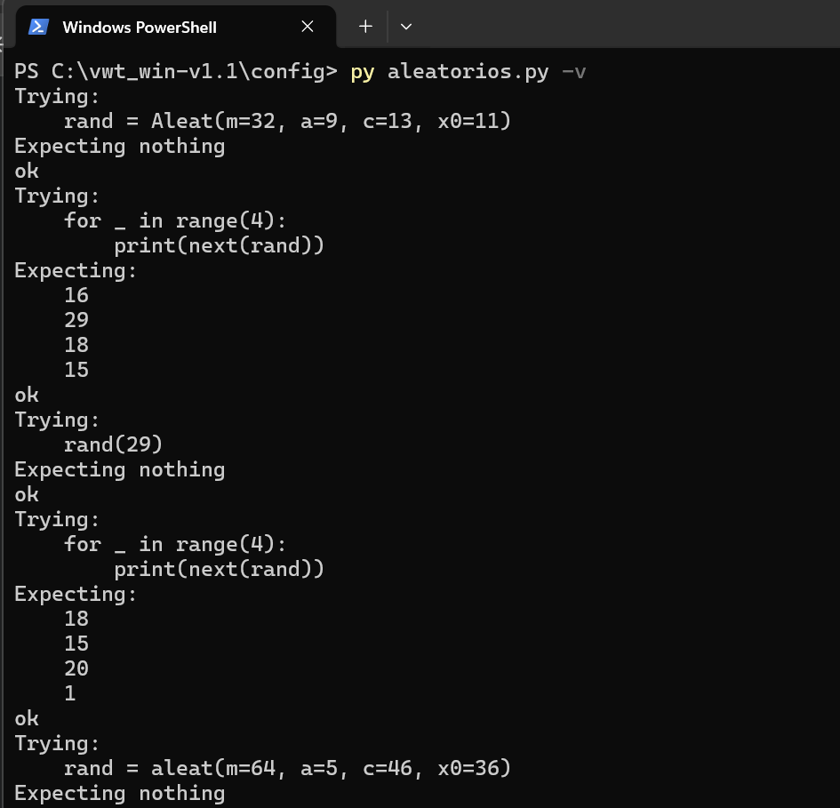
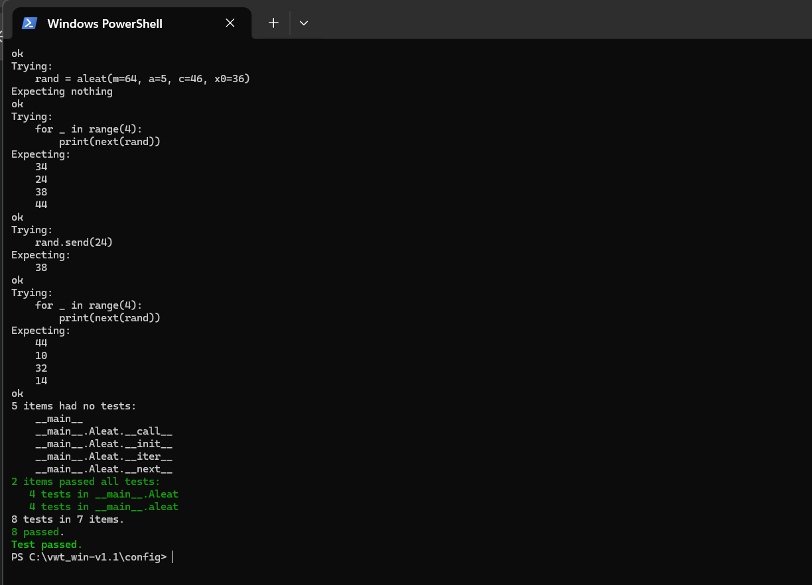

# Cuarta tarea de APA 2023: Generación de números aleatorios

## Nom i cognoms

> **Albert Blázquez**

---

## Descripción del Proyecto

Este repositorio contiene la implementación de un generador de números aleatorios basado en el algoritmo de generación lineal congruente (**LGC**). Se han implementado dos soluciones distintas en Python:
1.  **Clase `Aleat`**: Un iterador formal que permite reiniciar la semilla mediante la sobrecarga del método `__call__`.
2.  **Generador `aleat()`**: Una función generadora que utiliza `yield` y permite el reinicio de la secuencia mediante el método `.send()`.

---

## Ejecución de los tests unitarios

A continuación se muestra el resultado de ejecutar el fichero `aleatorios.py` con la opción verbosa (`-v`), confirmando que todas las pruebas unitarias se han superado con éxito:




---

## Código desarrollado

El código se encuentra en el fichero `aleatorios.py` y cumple con los estándares de estilo **PEP-8**.

```python
"""
Fichero: aleatorios.py
Autor: Albert Blázquez
Descripción: Implementación de generadores de números aleatorios LGC.
"""

class Aleat:
    """
    Clase que implementa un generador de números aleatorios.

    Atributos:
        m (int): módulo.
        a (int): multiplicador.
        c (int): incremento.
        x (int): estado actual (semilla/último número generado).

    Métodos:
        __init__: inicializa los parámetros del generador (keyword-only).
        __next__: calcula y devuelve el siguiente número de la secuencia.
        __iter__: devuelve el propio objeto como iterador.
        __call__: reinicia la secuencia con una nueva semilla (positional-only).
    
    Pruebas unitarias:
    >>> rand = Aleat(m=32, a=9, c=13, x0=11)
    >>> for _ in range(4):
    ...     print(next(rand))
    16
    29
    18
    15
    >>> rand(29)
    >>> for _ in range(4):
    ...     print(next(rand))
    18
    15
    20
    1
    """

    def __init__(self, *, m=2**48, a=25214903917, c=11, x0=1212121):
        self.m = m
        self.a = a
        self.c = c
        self.x = x0

    def __iter__(self):
        return self

    def __next__(self):
        self.x = (self.a * self.x + self.c) % self.m
        return self.x

    def __call__(self, x0, /):
        self.x = x0

def aleat(*, m=2**48, a=25214903917, c=11, x0=1212121):
    """
    Función generadora de números aleatorios.

    Argumentos:
        m (int): módulo (por defecto POSIX).
        a (int): multiplicador (por defecto POSIX).
        c (int): incremento (por defecto POSIX).
        x0 (int): semilla inicial.

    Yields:
        int: el siguiente número pseudoaleatorio de la secuencia.

    Pruebas unitarias:
    >>> rand = aleat(m=64, a=5, c=46, x0=36)
    >>> for _ in range(4):
    ...     print(next(rand))
    34
    24
    38
    44
    >>> rand.send(24)
    38
    >>> for _ in range(4):
    ...     print(next(rand))
    44
    10
    32
    14
    """
    x = x0
    while True:
        x = (a * x + c) % m
        recibido = yield x
        if recibido is not None:
            x = recibido

if __name__ == "__main__":
    import doctest
    doctest.testmod(verbose=True)
